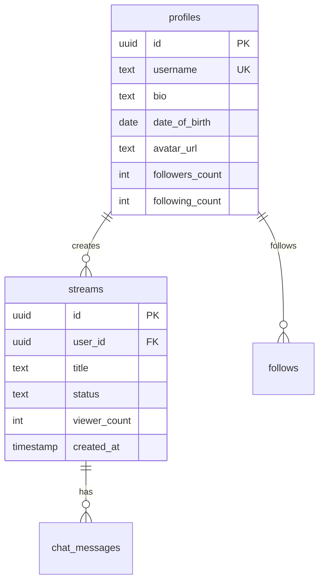

# iccifree.com
# 🔥 ICCI FREE - Stream Without Limits


**La piattaforma di live streaming dove puoi finalmente parlare liberamente.**

🌐 **Live:** [iccifree.com](https://iccifree.com)

## 🚀 Features

- ✅ **Streaming WebRTC P2P** - Latenza <1 secondo
- ✅ **No Censura Stupida** - Esprimi le tue opinioni
- ✅ **Chat Real-time** - Interagisci con i viewers
- ✅ **Sistema Follow** - Costruisci la tua community
- ✅ **OAuth Login** - Google & Discord
- ✅ **Mobile Responsive** - Funziona ovunque
- ✅ **Screen Sharing** - Condividi schermo/app
- ✅ **Multi-Camera** - Switch front/back camera

## 🛠️ Tech Stack

- **Frontend:** HTML5, CSS3, JavaScript (Vanilla)
- **Backend:** Supabase (PostgreSQL, Auth, Realtime, Storage)
- **Streaming:** WebRTC peer-to-peer
- **Hosting:** Vercel / GitHub Pages
- **CDN:** Cloudflare (optional)

## 📦 Quick Start

### 1. Clone il repository
```bash
git clone https://github.com/tuousername/iccifree.git
cd iccifree
```

### 2. Setup Supabase

1. Crea un progetto su [Supabase](https://supabase.com)
2. Esegui lo script SQL:
```sql
-- Copia il contenuto di docs/SETUP_DATABASE.sql nel SQL Editor di Supabase
```

3. Configura le API keys in `js/supabase.js`:
```javascript
const SUPABASE_URL = 'your-project-url';
const SUPABASE_ANON_KEY = 'your-anon-key';
```

### 3. Deploy

#### Opzione A: Vercel (Consigliato)
[](https://vercel.com/new/clone?repository-url=https://github.com/tuousername/iccifree)

#### Opzione B: GitHub Pages
1. Settings → Pages → Deploy from branch (main)
2. Aggiungi file `CNAME` con il tuo dominio

### 4. Configura OAuth (Opzionale)

In Supabase Authentication → Providers:
- Enable Google OAuth
- Enable Discord OAuth
- Aggiungi redirect URL: `https://yourdomain.com/callback.html`

## 📁 Struttura Progetto

```
iccifree/
├── index.html           # Landing page
├── dashboard.html       # Dashboard streams
├── golive-webrtc.html   # Broadcast page
├── stream-webrtc.html   # Viewer page
├── css/                 # Stili
├── js/                  # JavaScript
│   ├── webrtc-streaming.js  # WebRTC core
│   └── supabase.js          # Config
└── docs/                # Documentazione
```

## 🎥 Come Funziona

### Per Streamer:
1. Login/Registrazione
2. Click "GO LIVE"
3. Inserisci titolo stream
4. Permetti accesso camera/mic
5. Inizia streaming!

### Per Viewer:
1. Browse streams su dashboard
2. Click su uno stream live
3. Guarda e chatta in real-time

## 🔐 Sicurezza

- ✅ Row Level Security (RLS) su tutte le tabelle
- ✅ Auth JWT tokens
- ✅ HTTPS required per WebRTC
- ✅ Rate limiting su API
- ✅ Input sanitization

## 📊 Database Schema



## 🚧 Roadmap

### Phase 1 (Current) ✅
- [x] Basic streaming WebRTC
- [x] User authentication
- [x] Chat system
- [x] Follow system

### Phase 2 (Q2 2025) 
- [ ] Stream recording/VOD
- [ ] Clips (30 sec)
- [ ] Mobile apps
- [ ] Donations system

### Phase 3 (Q3 2025)
- [ ] Multi-streaming
- [ ] Stream to YouTube/Twitch
- [ ] AI moderation
- [ ] Analytics dashboard

## 🤝 Contributing

Contribuzioni sono benvenute! 

1. Fork il progetto
2. Crea feature branch (`git checkout -b feature/AmazingFeature`)
3. Commit changes (`git commit -m 'Add AmazingFeature'`)
4. Push to branch (`git push origin feature/AmazingFeature`)
5. Apri Pull Request

## 📜 License

Distribuito sotto licenza MIT. Vedi `LICENSE` per maggiori informazioni.

## 🙏 Credits

Creato con ❤️ dal team ICCI FREE

- WebRTC implementation
- Supabase backend
- Community contributors

## 📞 Support

- Email: support@iccifree.com
- Discord: [Join our server](https://discord.gg/iccifree)
- Issues: [GitHub Issues](https://github.com/tuousername/iccifree/issues)

## ⚠️ Disclaimer

ICCI FREE supporta la libertà di espressione ma NON tollera:
- Contenuti illegali
- Harassment/bullying
- Contenuti NSFW senza warning
- Violazione copyright

---

**Built for freedom. Made with 🔥**

*Se ti piace il progetto, lascia una ⭐ su GitHub!*
